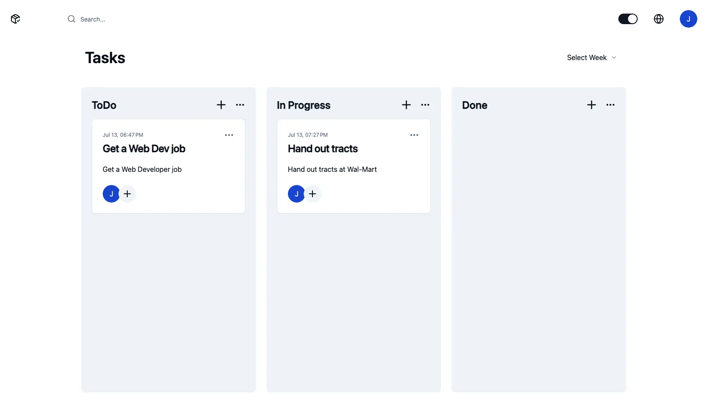

# Task Manager - Create, Read, Search, Update, Delete, Delete All

**`Next, ShadCn, Tailwind, React Email, Llama 3, Node, Express, Mongo, Redis, Jest, Sentry, Husky`**

---

Special Features:

---

Update task progress or user roles in kanban style

Add/remove multiple users to designated tasks

Redis caching for high performance reads

Owner autmoatically emailed when tasks are complete

Change password link via email

Completed tasks over a month-old automatically deleted

User clock-in can keep running when leaving site

AI Assitant gives suggestions in New York accent

Languages in English & Chinese
